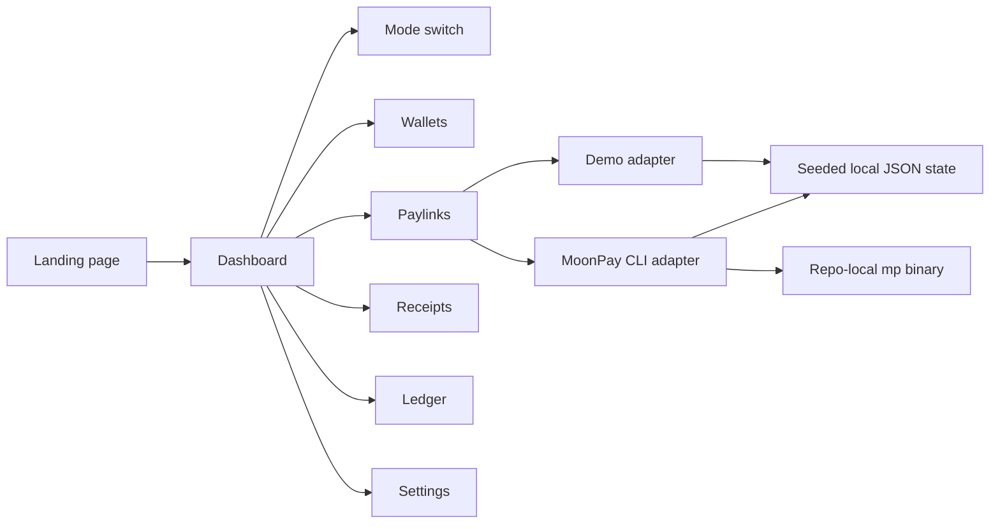

# PaylinkOps

PaylinkOps is a minimalist merchant operations console for AI agents and crypto-native teams. It creates MoonPay deposit links, tracks incoming payments, reconciles receipts, and prepares treasury sweeps.

It has two operating modes:

- `Demo mode` works out of the box with seeded wallets, paylinks, ledger entries, and receipts.
- `Real mode` uses the local MoonPay CLI (`mp`) with a real authenticated wallet and live deposit link support.

## Why it exists

The core promise is simple: create a payment link, track the money, and keep auditable receipts. That is the smallest useful MoonPay-shaped product that still demonstrates real CLI value instead of a generic wallet demo.

## Sponsor fit

Primary track: MoonPay CLI Agents.

Secondary track: OpenWallet Standard is a possible future extension if the wallet layer becomes strong enough to stand on its own.

## What is included

- Landing page with a sponsor-aware pitch.
- Dashboard with mode switch, wallet status, paylinks, ledger, receipts, and settings.
- Demo data that works without external services.
- Real-mode CLI integration that detects `mp`, lists wallets, creates deposit links, and inspects deposits or transactions when available.
- Receipt-first auditing for every action.
- Sweep planning with explicit confirmation for execution.

## Verified MoonPay evidence

The repo now has a verified local MoonPay CLI flow using a repo-local authenticated config.

- MoonPay CLI version: `1.12.4`
- Real wallet alias: `main`
- Real deposit id: `69c0cc009ec7c7dbcfb5e50c`
- Real deposit status: `active`
- Real deposit URL: [moonpay.hel.io/embed/deposit/b19ac33d-e916-4a88-b12f-cfd25a93a9f9](https://moonpay.hel.io/embed/deposit/b19ac33d-e916-4a88-b12f-cfd25a93a9f9)

## On-chain evidence

The strongest public chain evidence currently available is the live destination wallet and the prior Synthesis registration transaction.

- Ethereum destination wallet: `0x870F29bD50CE5fe3e29437BB46a000318B07aA47`
- Ethereum explorer: [etherscan.io/address/0x870F29bD50CE5fe3e29437BB46a000318B07aA47](https://etherscan.io/address/0x870F29bD50CE5fe3e29437BB46a000318B07aA47)
- Base explorer for same EVM wallet: [basescan.org/address/0x870F29bD50CE5fe3e29437BB46a000318B07aA47](https://basescan.org/address/0x870F29bD50CE5fe3e29437BB46a000318B07aA47)
- Bitcoin wallet: `bc1qqkjqqf2zzvgrfvdy0ecrx30wyjuha0f8gcj7lv`
- Bitcoin explorer: [mempool.space/address/bc1qqkjqqf2zzvgrfvdy0ecrx30wyjuha0f8gcj7lv](https://mempool.space/address/bc1qqkjqqf2zzvgrfvdy0ecrx30wyjuha0f8gcj7lv)
- Synthesis registration transaction: [basescan.org/tx/0x30806b449bf3e1b5e740b94ed9ebcc4c278f40fec702d9f905940263c526b8f7](https://basescan.org/tx/0x30806b449bf3e1b5e740b94ed9ebcc4c278f40fec702d9f905940263c526b8f7)

Important note:

- A real MoonPay deposit link has been created, but no inbound on-chain payment transaction has been executed yet in this repo workflow, so there is no confirmed payment tx hash to show judges yet.

## Local setup

```bash
npm install
npm run dev
```

### Real mode setup

The repo now supports a repo-local MoonPay CLI install and auth state, so you do not need to rely on a global install.

```bash
npm_config_cache=$PWD/.local/npm-cache npm install -g @moonpay/cli --prefix $PWD/.local/npm-global
./.local/npm-global/bin/mp login --email YOUR_EMAIL
./.local/npm-global/bin/mp verify --email YOUR_EMAIL --code YOUR_CODE
./.local/npm-global/bin/mp wallet create --name main
```

The app resolves the local CLI automatically from `.local/npm-global/bin/mp` and uses `.local/moonpay-home` for local auth/config state.

## Validation

Passed locally:

- `npm run lint`
- `npm run typecheck`
- `npm run test:unit`
- `npm run build`
- `npm run test:smoke`
- `npm run test:e2e:orbstack`

## Playwright

Host-side Playwright browser download is unreliable in this environment because Chromium download fails at the upstream storage hop.

The working fallback is OrbStack/Docker:

```bash
npm run test:e2e:orbstack
```

## Demo flow

1. Open `/`.
2. Go to `/dashboard`.
3. Stay in `Demo mode`.
4. Create a demo paylink.
5. Open the receipts page.
6. Load the sample merchant scenario.
7. Check the ledger.

## Real flow

1. Authenticate the repo-local MoonPay CLI.
2. Switch to `Real mode`.
3. Refresh wallets and confirm `main` is present.
4. Create or inspect a live paylink.
5. Open receipts and show the raw stored output.
6. Show the destination wallet explorer links from this README or the submission notes.

## Architecture



## Static assets

- Cover image: `public/cover.png`
- Additional cover source: `public/cover.svg`
- Screenshot assets: `public/screenshots/`

## Submission assets

The public repo includes a judge-safe submission bundle in `submission/` with no secrets, no private auth material, and no unpublished team tokens.

## Honest limitations

- Real mode still depends on MoonPay platform availability and your local authenticated CLI state.
- Final Synthesis publish remains blocked until explicit user confirmation.
- There is still no confirmed inbound payment transaction hash in this repo flow because no live payment has been sent to the created deposit yet.

## What is left before final submission

- Optional but recommended public deployment URL.
- Optional but recommended demo video URL.
- A real incoming payment tx hash if you want stronger on-chain proof than wallet/deposit evidence alone.
- Final human confirmation before Synthesis publish.
