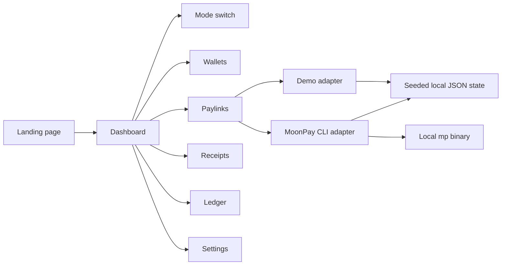

# PaylinkOps

PaylinkOps is a minimalist merchant operations console for AI agents and crypto-native teams. It creates MoonPay deposit links, tracks incoming payments, reconciles receipts, and prepares treasury sweeps.

It has two modes:

- `Demo mode` works out of the box with seeded wallets, paylinks, ledger entries, and receipts.
- `Real mode` uses the local MoonPay CLI (`mp`) when it is installed and already authenticated on the user's machine.

## Why it exists

The core promise is simple: create a payment link, track the money, and keep auditable receipts. That is the smallest useful MoonPay-shaped product that still demonstrates real CLI value instead of a generic wallet demo.

## Sponsor fit

Primary track: MoonPay CLI Agents.

Secondary track: OpenWallet Standard is only a possible future extension if the wallet layer becomes strong enough to stand on its own.

## What is included

- Landing page with a clean sponsor-aware pitch.
- Dashboard with mode switch, wallet status, paylinks, ledger, receipts, and settings.
- Demo data that works without external services.
- Real-mode CLI integration that detects `mp`, lists wallets, creates deposit links, and inspects deposits or transactions when available.
- Receipt-first auditing for every action.
- Sweep planning with explicit confirmation for execution.

## Local setup

1. Install dependencies.
2. Install the MoonPay CLI if you want real mode.
3. Authenticate the CLI in your terminal.
4. Run the app.

```bash
npm install
npm install -g @moonpay/cli
mp login --email YOUR_EMAIL
mp verify --email YOUR_EMAIL --code YOUR_CODE
npm run dev
```

Real mode is intentionally handled outside the web app. The app only detects the local CLI and uses it if it is already authenticated.

## Demo flow

1. Open `/`.
2. Go to `/dashboard`.
3. Stay in `Demo mode`.
4. Create a demo paylink.
5. Open the receipts page.
6. Load the sample merchant scenario.
7. Check the ledger.

## Real flow

1. Install and authenticate `mp`.
2. Switch to `Real mode` in settings or the dashboard.
3. Refresh wallets.
4. Create a live paylink.
5. Inspect the paylink transactions.
6. Keep the generated receipt as proof of the action.

## Architecture



## Static assets

- Cover image: `public/cover.png`
- Additional cover source: `public/cover.svg`
- Screenshot assets: `public/screenshots/`

## Submission assets

Submission-specific metadata, team identifiers, project identifiers, and publish notes are intentionally kept in a local gitignored `submission/` folder when needed. Do not commit live submission payloads or other private operational context to the public repo.

## Honest limitations

- Real mode requires local `mp` authentication.
- Final Synthesis submit is intentionally blocked until the user confirms it in the active session.
- The screenshot assets here are capture targets and placeholders; replace them with real captures before final submission if needed.

## Future work

- Better real-mode transaction parsing from broader MoonPay CLI output shapes.
- Optional sweep execution behind the existing confirmation gate.
- CSV export for ledger and receipts.
