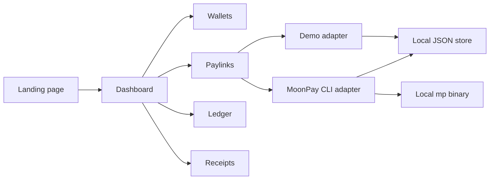

# PaylinkOps

PaylinkOps is a merchant operations console for MoonPay-powered teams. It creates payment links, tracks incoming payments, reconciles receipts, and prepares treasury follow-up without turning the product into a broad accounting system.

## Live Demo

- Product site: [paylinkops.xyz](https://paylinkops.xyz)
- Dashboard: [paylinkops.xyz/dashboard](https://paylinkops.xyz/dashboard)

## What It Does

- Creates and inspects MoonPay payment links.
- Tracks wallet, paylink, ledger, and receipt state in one dashboard.
- Provides deterministic demo data for a public-safe hosted experience.
- Uses the local MoonPay CLI (`mp`) for real mode when it is installed and authenticated.
- Keeps raw CLI output behind sanitized receipt objects instead of relying on terminal history.

## Demo And Real Modes

`Demo mode` is the default public path. It uses seeded wallets, paylinks, ledger rows, and receipts so the product can be reviewed without credentials.

`Real mode` runs locally against an authenticated MoonPay CLI. The web app does not ask users to paste MoonPay credentials; it only calls the local CLI when that environment is already configured.

## Quick Start

```bash
npm install
npm run dev
```

Open `http://localhost:3000/dashboard`.

## Real Mode Setup

Install and authenticate MoonPay CLI outside of git-tracked files. A repo-local install also works:

```bash
npm_config_cache=$PWD/.local/npm-cache npm install -g @moonpay/cli --prefix $PWD/.local/npm-global
./.local/npm-global/bin/mp login --email YOUR_EMAIL
./.local/npm-global/bin/mp verify --email YOUR_EMAIL --code YOUR_CODE
```

The app can resolve `.local/npm-global/bin/mp` and use ignored `.local/` state. Do not commit CLI auth state, logs, `.env.local`, `.local/`, `.secrets/`, or `.vercel/`.

## Architecture


```mermaid
flowchart LR
  Landing["Landing page"] --> Dashboard["Dashboard"]
  Dashboard --> Wallets["Wallets"]
  Dashboard --> Paylinks["Paylinks"]
  Dashboard --> Ledger["Ledger"]
  Dashboard --> Receipts["Receipts"]
  Paylinks --> Demo["Demo adapter"]
  Paylinks --> CLI["MoonPay CLI adapter"]
  CLI --> MP["Local mp binary"]
  Demo --> Store["Local JSON store"]
  CLI --> Store
```

## Public Proof

This repo includes public proof artifacts from a real MoonPay-oriented flow:

- Live destination wallet: `0x870F29bD50CE5fe3e29437BB46a000318B07aA47`
- Ethereum explorer: [etherscan.io/address/0x870F29bD50CE5fe3e29437BB46a000318B07aA47](https://etherscan.io/address/0x870F29bD50CE5fe3e29437BB46a000318B07aA47)
- Confirmed inbound payment: [etherscan.io/tx/0x06d391316044787ee27c790dc797b6ccfc7a796eac02725f508457dfa9d54c54](https://etherscan.io/tx/0x06d391316044787ee27c790dc797b6ccfc7a796eac02725f508457dfa9d54c54)
- Live deposit id: `69c0cc009ec7c7dbcfb5e50c`

Private submission payloads and live operational notes belong in ignored local files, not in git.

## Scripts

```bash
npm run lint
npm run typecheck
npm run test:unit
npm run build
npm run test:smoke
npm run test:e2e
```

`npm run test:e2e:orbstack` is available as a local fallback when host browser downloads are unreliable.

## Limits

- Real mode depends on MoonPay CLI availability and local authentication.
- Public hosted mode is demo-first and does not carry private CLI session state.
- The app focuses on paylink operations and reconciliation; it is not full accounting software.
